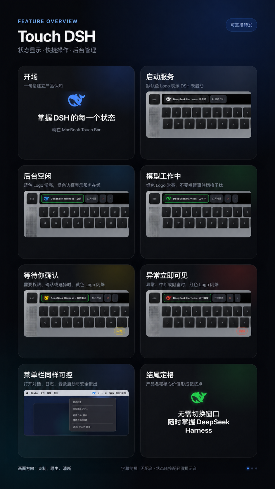

# Touch DSH

English | [简体中文](README.md)

> **Unofficial community project.** Touch DSH is not affiliated with, sponsored by, or endorsed by DeepSeek.



## Why Touch DSH?

DeepSeek Harness (`dsh`) is primarily launched from a terminal. Closing its browser tab does not stop the background service, and returning to it means reopening a terminal and entering another command. It is also difficult to see at a glance whether the model is working, waiting for confirmation, or has stopped with an error.

Touch DSH moves these frequent actions into the macOS menu bar and, optionally, the Touch Bar. You can see the current state, start DSH, open the conversation, and safely stop its background service without keeping a terminal window open.

It addresses four practical pain points:

- **Repeated terminal startup:** no need to type `dsh web` every time.
- **Unclear state:** logo colors show idle, working, waiting, and error states.
- **Browser/service confusion:** closing the web page no longer hides whether DSH is still running.
- **Awkward shutdown:** validated safe-stop avoids terminating unrelated Node processes.

## Choose an edition

| Your Mac | Download | Interface |
| --- | --- | --- |
| **Mac with a Touch Bar** | `Touch-DSH-TouchBar-0.1.0-beta.1.zip` | Touch Bar controls plus a menu-bar fallback |
| **Mac without a Touch Bar** | `Touch-DSH-Menu-0.1.0-beta.1.zip` | Menu bar only; contains no private Touch Bar integration |

Both downloads are **Universal 2** applications supporting Intel (`x86_64`) and Apple silicon (`arm64`) in one file. You do not need separate M-series and Intel downloads. Do not run both editions at the same time.

Go to [Releases](https://github.com/Rocky918/Touch-DSH/releases/latest) to download an edition.

## Prerequisites

Before installing Touch DSH, confirm that:

1. Your Mac runs macOS 13 or later.
2. DeepSeek Harness is already installed and `dsh --version` works in Terminal.
3. The only fully verified compatibility baseline is currently **DeepSeek Harness `0.1.1-rc.2`**. This version is recommended during beta testing.
4. The Touch Bar edition requires a Mac with a physical Touch Bar.

Touch DSH does not bundle or install DeepSeek Harness. DSH remains developer-preview software and future versions may introduce breaking changes.

## Installation

1. Download the appropriate ZIP from [Releases](https://github.com/Rocky918/Touch-DSH/releases/latest).
2. Double-click the ZIP to extract it.
3. Move `Touch DSH.app` or `Touch DSH Menu.app` to `/Applications`.
4. The current beta uses an ad-hoc signature and is not Apple-notarized. On first launch, Control-click the app and choose **Open**. If macOS still blocks it, approve it under **System Settings → Privacy & Security**.
5. Find the whale icon in the menu bar. The Touch Bar edition also adds a whale capsule to the Control Strip.

Download only from this repository's Release page. You can verify the archives with the accompanying `SHA256SUMS.txt`.

## Usage

### Start DSH

- Menu bar: click the whale and choose **启动 DSH**.
- Touch Bar: tap the whale capsule to expand it, then choose **启动 DSH**.

After startup, Touch DSH connects to the local service at `http://127.0.0.1:3080/`. It discovers `dsh` in common Homebrew, NVM, Volta, pnpm, asdf, and local installation paths.

### Open the conversation

When DSH is online, choose **打开对话** to open the conversation in your default browser. Rapid repeated clicks are suppressed to avoid opening many duplicate tabs.

### Stop DSH completely

Choose **安全退出 DSH…** or the Touch Bar's **退出 DSH** button. Touch DSH verifies the listener on port 3080, user, launch time, and command before asking for confirmation and stopping that DSH process.

### Launch at login

Enable **开机自动启动** to launch the **Touch DSH companion** when you sign in to macOS. This does not automatically start DSH or open a browser; you remain in control of when the service starts.

### Status colors

- Default logo: DSH is not running
- Blue: idle
- Green: working
- Blinking yellow: waiting for approval, confirmation, or a choice
- Blinking red: error, interruption, or blocked state
- Green outline: the DSH service is online

## Video demo

[Watch the 20-second Touch DSH demo](https://github.com/Rocky918/Touch-DSH/releases/download/v0.1.0-beta.1/Touch-DSH-Demo.mp4)

## Beta notes

- `0.1.0-beta.1` is the first public beta and should be tested on different Mac models.
- The Touch Bar edition relies on undocumented macOS APIs. It is unsuitable for the Mac App Store and may be affected by future macOS updates.
- This build has no Developer ID notarization; follow the first-launch steps above.
- When filing a bug, remove usernames, paths, prompts, credentials, and other private information from logs and screenshots.

## Security and privacy

- Connects only to the local DSH service on `127.0.0.1:3080`.
- Collects no telemetry and never reads or stores model API keys.
- Revalidates process identity before stopping DSH, protecting against PID replacement.
- Stores output in `~/Library/Logs/Touch DSH/dsh-web.log`, restricted to the current user, and rotates it at 5 MB.

See [SECURITY.md](SECURITY.md) and the [testing matrix](docs/TESTING.md).

## Uninstallation

Disable **开机自动启动**, choose **退出 Touch DSH**, remove the app from `/Applications`, and optionally delete `~/Library/Logs/Touch DSH/`. Removing Touch DSH does not uninstall DeepSeek Harness.

## Building from source

Xcode 15 or later and a Swift 5.9 toolchain are required. The project is verified on an Intel Mac with Xcode 26.5.

```sh
swift test
zsh Scripts/package.sh
```

The script builds Intel and Apple-silicon slices separately and combines them into two Universal 2 apps under `dist/`. Set `SIGN_IDENTITY` to use a Developer ID identity.

## License and brand notice

Source code is available under the [MIT License](LICENSE). DeepSeek, DeepSeek Harness, and related brand assets belong to their respective rights holders and are not relicensed by the MIT License. Follow the [DeepSeek Harness Brand Asset Usage Guidelines](https://github.com/deepseek-ai/deepseek-harness/blob/master/BRAND_GUIDELINES.md).
